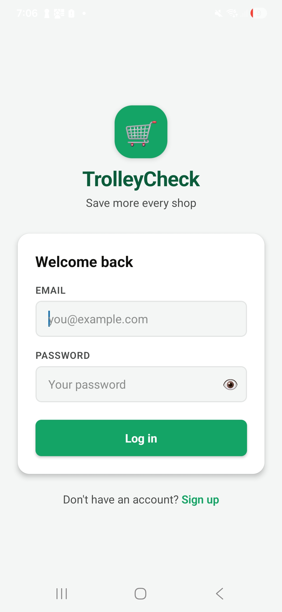
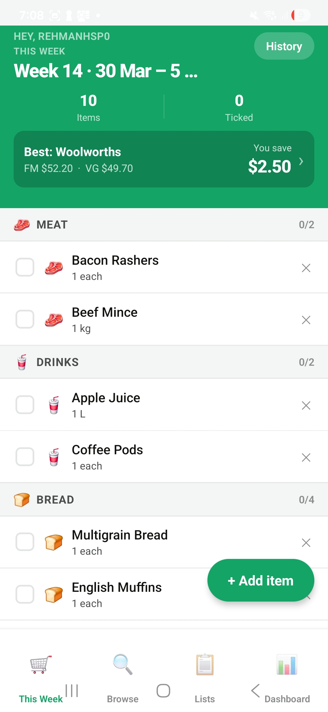
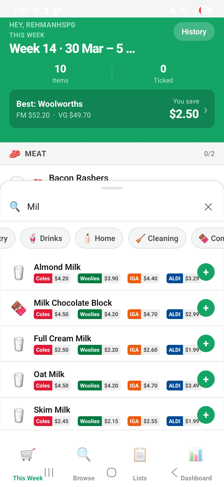
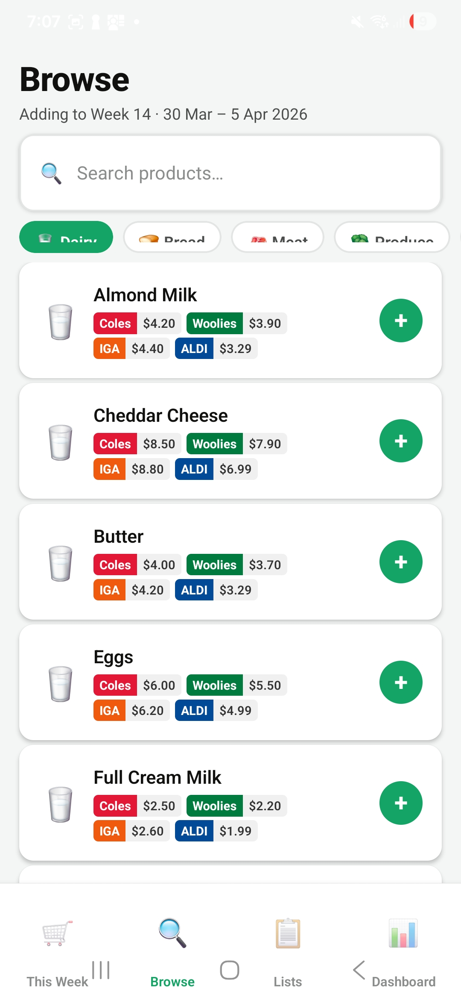
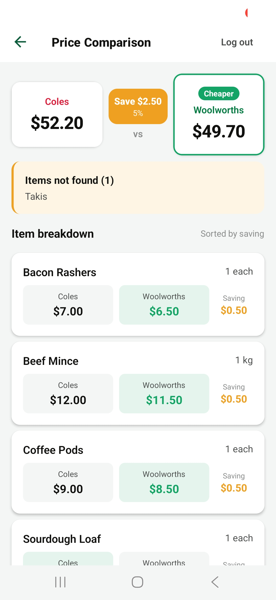
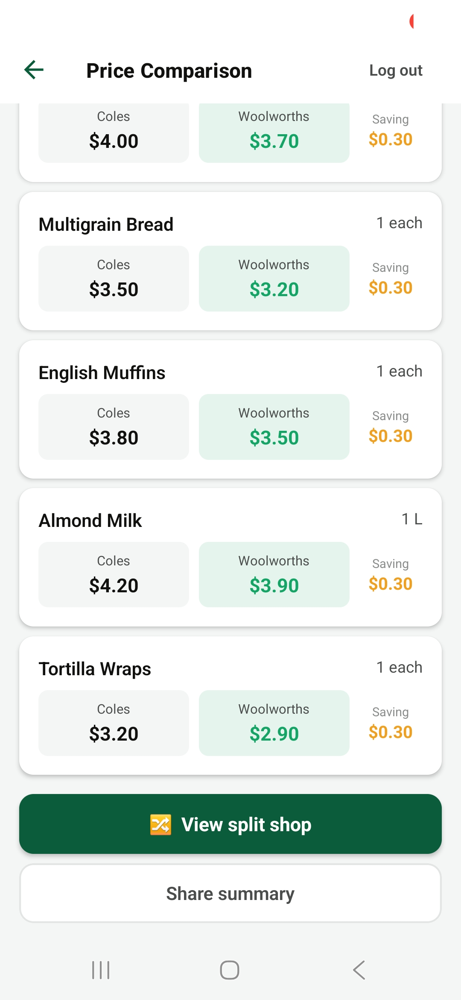
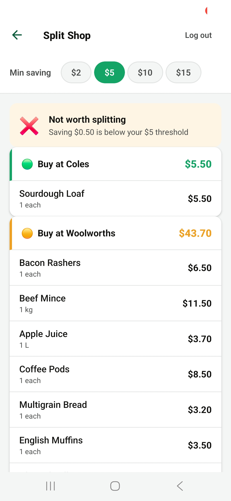
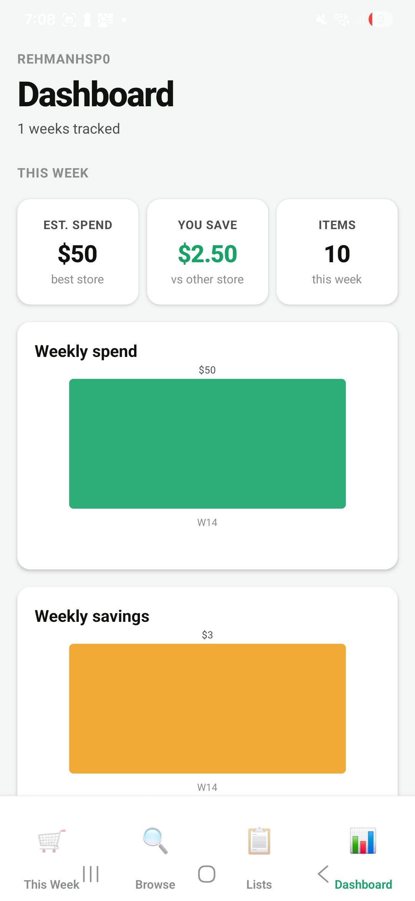

# TrolleyCheck Pilot — Executive Build Summary

<p align="center">
  
</p>

<p align="center"><strong>From a single prompt to a fully deployed, tested, production-ready application.</strong></p>

---

## The Starting Point — One Prompt

The entire project began with a single instruction handed to Claude Code:

> *"Hand this to Claude Code to begin building. Every decision is documented. Every story has acceptance criteria."*

That instruction was attached to `SPEC.md` — a 600-line product specification written before a single line of code existed. It defined the problem, the stack, the user stories, the data model, the API contract, the CI/CD pipeline, the security rules, and the Azure migration path. Claude Code was given the spec and told to build story by story, raise a GitHub issue per story, branch from `develop`, and not proceed to the next story until the previous one was reviewed.

No scaffolding. No starter kit. Just a spec and Claude Code.

---

## What TrolleyCheck Does

Australians overspend on groceries because prices vary significantly between Coles, Woolworths, IGA and ALDI — but comparing them manually takes time. TrolleyCheck solves this in three steps.

### Step 1 — Build your weekly list

The user opens the app and creates a grocery list for the week. They can:

- Search the product catalogue (90+ items across 9 categories — Dairy, Bread, Meat, Produce, Pantry, Drinks, Household, Cleaning, Confectionery)
- See live prices from all 4 stores on every product before adding
- Add products with one tap, or type a custom item not in the catalogue
- Set quantity and unit for each item
- Tick items off as they shop

The app remembers their list week to week and carries over any unticked items automatically.

### Step 2 — Compare the full basket

With one tap on **Compare prices**, the app sends the full list to the API, which:

1. Looks up the current price of every item at Coles and Woolworths
2. Calculates the total cost at each store
3. Identifies which store is cheaper overall and by how much
4. Returns an item-level breakdown sorted by saving

The result screen shows the total at both stores, the saving amount highlighted in green, and a colour-coded breakdown of every item with its price at each supermarket.

### Step 3 — Split shop for maximum saving

The **Split Shop** feature goes further. Instead of saying "go to Woolworths", it asks: *what if you split your shop between both stores?*

The optimiser calculates:

- Which items are cheaper at Coles → buy those at Coles
- Which items are cheaper at Woolworths → buy those at Woolworths
- Whether the combined saving crosses the user's minimum threshold (configurable: $2 / $5 / $10 / $15)
- The combined saving vs. doing the full shop at one store

The result is two separate lists — one per store — with the total for each. Users can share either list directly from the app.

### Dashboard — savings over time

The Dashboard shows the user's savings history across past weeks with spend and savings charts, helping them understand their spending patterns and reinforce the habit of comparing before they shop.

---

## The App — Screenshots

### Login

<p align="center">
  
</p>

*Clean login screen with the TrolleyCheck brand. Email and password authentication via Supabase JWT.*

---

### This Week — Weekly Shopping List

<p align="center">
  
  &nbsp;&nbsp;&nbsp;
  
</p>

*The weekly list groups items by category with tick-off checkboxes. The green header shows the personalised greeting, week number, item count, and the current best-store recommendation with savings — updated live as items are added.*

---

### Add Item — Live Product Search with All 4 Store Prices

<p align="center">
  
</p>

*Searching "Mil" returns matching products instantly. Each result shows colour-coded price badges for all four stores — Coles (red), Woolworths (green), IGA (orange), ALDI (blue) — so users know the best price before they even add the item.*

---

### Browse — Product Catalogue

<p align="center">
  
</p>

*The Browse tab lets users explore 90+ products across 9 categories. Every product shows prices at all 4 stores with brand-coloured badges. One tap adds to the current weekly list.*

---

### Price Comparison

<p align="center">
  
  &nbsp;&nbsp;&nbsp;
  
</p>

*The comparison screen shows the full basket total at Coles and Woolworths side by side, with the cheaper store highlighted in green. Below, every item is listed with its price at each store and the saving — sorted by biggest saving first. Items not found in the catalogue are flagged. The "View split shop" and "Share summary" buttons appear at the bottom.*

---

### Split Shop Optimiser

<p align="center">
  
</p>

*The split shop screen lets users set a minimum saving threshold ($2 / $5 / $10 / $15). If the saving doesn't cross the threshold, the app tells them it's not worth splitting. When it is, items are split into two lists — one per store — with the subtotal for each. In this example: 1 item at Coles ($5.50) and 8 items at Woolworths ($43.70).*

---

### Dashboard

<p align="center">
  
</p>

*The dashboard shows estimated spend ($50), saving vs the other store ($2.50), item count (10), and bar charts for weekly spend and weekly savings — building a picture of habits over time.*

---

## What Was Built

### Stores supported (pilot)

| Store | Brand colour |
|---|---|
| Coles | Red `#E31837` |
| Woolworths | Green `#007B40` |
| IGA | Orange `#EF5A0E` |
| ALDI | Blue `#004A97` |

### Screens delivered

| Screen | Purpose |
|---|---|
| Login / Register | Supabase Auth JWT flow |
| This Week | Weekly shopping list with automatic carry-over |
| Browse | Search 90+ products across 9 categories |
| My Lists | Create, manage and delete grocery lists |
| List Detail | Add items, tick off, see item counts |
| Price Comparison | Full basket total — Coles vs Woolworths |
| Split Shop | Per-item store routing for maximum saving |
| Dashboard | Savings history and spend trends |

---

## The Stack

| Layer | Technology | Detail |
|---|---|---|
| API language | TypeScript (strict mode) | Zero `any`, full type safety |
| API framework | Express v5 | REST — 25+ endpoints |
| ORM | Prisma v7 | All DB access via Prisma only — no raw SQL |
| Database | Supabase PostgreSQL | Sydney region, row-level security |
| Auth | Supabase JWT | 15 min access tokens / 7 day refresh |
| Cache | Upstash Redis | 6hr TTL on price data |
| Validation | Zod | Every request body and query param |
| Logging | pino | Structured JSON, zero PII |
| Mobile | React Native + Expo SDK 54 | iOS + Android |
| State management | Zustand + React Query | Optimistic updates, caching |
| Containerisation | Docker (Node 20 Alpine) | Multi-stage build, minimal image |
| Orchestration | docker-compose | Local dev — API + DB + Redis |
| CI/CD | GitHub Actions | Lint → Test → Audit → Docker build |
| Hosting | Railway (Sydney) | Auto-deploy from main |
| IaC | Terraform | Railway + Azure Container Apps drafted |

---

## SDLC — How It Was Run

Every story followed the same flow without exception:

```
SPEC.md story
    │
    ▼
GitHub Issue raised (TC-n)
    │
    ▼
feature/TC-n-description branch from develop
    │
    ▼
Claude Code implements + TypeScript check + tests pass
    │
    ▼
PR → develop → CI pipeline runs
    │
    ▼
Reviewed and merged
    │
    ▼
Release PR: develop → main → Railway auto-deploys
```

### GitHub Issues across the build

| # | Story / Bug | Type | Status |
|---|---|---|---|
| TC-1 | User registration | Story | Closed |
| TC-2 | User login | Story | Closed |
| TC-3 | Token refresh | Story | Closed |
| TC-4 | Logout and account deletion | Story | Closed |
| TC-5 | Grocery list CRUD | Story | Closed |
| TC-6 | Grocery item CRUD | Story | Closed |
| TC-7 | Item reordering | Story | Closed |
| TC-8 | Duplicate list | Story | Closed |
| TC-9 | Compare basket prices | Story | Closed |
| TC-10 | Item-level price breakdown | Story | Closed |
| TC-11 | Split-shop optimiser | Story | Closed |
| TC-12 | Product catalogue + seed data | Story | Closed |
| TC-13 | Dockerfile + docker-compose | Story | Closed |
| TC-14 | GitHub Actions CI/CD | Story | Closed |
| TC-15 | React Native mobile app | Story | Closed |
| #44 | CI failing after store rename | Bug | Closed |
| #45 | Delete button not working on web | Bug | Closed |
| #46 | Tab bar disappears in list detail | Bug | Closed |
| #47 | Keyboard overlaps add-item panel | Bug | Closed |
| #48 | Tab bar overlaps Android gesture bar | Bug | Closed |

**Total commits:** 62 &nbsp;|&nbsp; **Merge commits:** 15 &nbsp;|&nbsp; **Branches used:** 18

---

## Security — Built In, Not Bolted On

Security was mandated in the spec as non-negotiable. Every rule was implemented and enforced by CI.

| Control | Implementation |
|---|---|
| Authentication | Supabase JWT — every API route protected |
| Token lifecycle | 15 min access tokens, 7 day refresh, full revocation on logout |
| Input validation | Zod schemas on every request body and query param |
| Row-level security | All DB queries scoped to `userId` — users cannot see each other's data |
| No PII in logs | pino logger — user IDs only, never email or names |
| Rate limiting | Applied to all endpoints |
| Dependency audit | `npm audit --audit-level=high` runs on every CI build |
| Secrets management | Zero hardcoded values — all config via environment variables |
| SQL injection | Impossible — Prisma ORM only, no raw queries |
| CORS | Configured explicitly — no wildcard origins in production |
| Container | Node 20 Alpine — minimal attack surface |
| Azure-ready | All 7 Azure migration rules enforced in every commit |

---

## Test Coverage

**8 test suites · 122 tests · 0 failures**

| Metric | Result | Target |
|---|---|---|
| Statements | **88.4%** | 80% |
| Functions | **83.9%** | 80% |
| Lines | **89.3%** | 80% |
| Branches | 66.9% | 60% |

> Delivered 8–9% above the 80% statement minimum.

### What is tested

| Suite | Covers |
|---|---|
| `auth.test.ts` | Register, login, refresh, logout, delete account, all error paths |
| `lists.test.ts` | CRUD, ownership enforcement, 401/404 responses |
| `items.test.ts` | Add, update, delete, toggle checked, reorder |
| `compare.test.ts` | Full basket comparison, cheaper store logic, edge cases |
| `split.test.ts` | Split-shop routing algorithm, savings calculation |
| `products.test.ts` | Search by name, category filter, store price filter |
| `duplicate.test.ts` | List duplication including all items |
| `health.test.ts` | DB and Redis cache health endpoint |

Tests run against mocked Prisma and Redis — no live database required in CI. Every test uses authenticated requests with the full JWT middleware exercised.

---

## CI/CD Pipeline

```
Push to feature/** or fix/**
        │
        ▼
  ┌─────────────────────────────────────────────┐
  │  Job 1: Lint + Test (Jest --coverage)        │
  │  Job 2: Security (npm audit --level=high)    │
  │  Job 3: Docker build validation              │
  └─────────────────────────────────────────────┘
        │  All pass?
        ▼
   PR → develop (code review gate)
        │
        ▼
   PR → main
        │
        ▼
   Railway auto-deploy (Sydney)
        │
        ▼
   Live: trolleycheck-pilot-production.up.railway.app
```

Path filters prevent mobile-only UI changes from triggering the API pipeline — Railway deploys are never affected by frontend-only fixes.

---

## What Claude Code Did

Claude Code was used as a senior engineering pair — not a code generator:

- Read the full spec before writing a single line
- Raised GitHub issues before starting each story
- Wrote TypeScript in strict mode — zero `any` escapes
- Wrote tests alongside the implementation, not after
- Caught its own TypeScript errors before committing
- Followed the branching strategy on every story without being reminded
- Debugged CI failures by reading actual error output, not guessing
- Fixed React Navigation architecture issues and mobile keyboard/safe-area bugs
- Enforced Azure migration rules across every file it touched

**Every file in this repo was written by Claude Code based on the spec and user prompts — no manual coding.**

---

## Pilot Next Steps

| Item | Status |
|---|---|
| EAS Build — shareable APK/IPA | Ready — Expo account needed |
| Real store price data | Phase 2 — data partnership or scraping |
| Push notifications — price alerts | Out of scope for pilot |
| Azure migration | Terraform drafted, 7 migration rules already enforced |
| App Store / Play Store listing | Requires EAS + developer accounts |
| Household sharing / collaborative lists | Out of scope for pilot |

---

## Summary

| Metric | Value |
|---|---|
| Time from spec to deployed app | 1 session |
| Lines of application code | ~6,000 |
| API endpoints | 25+ |
| Test cases | 122 |
| Statement coverage | 88.4% |
| GitHub issues | 20 |
| Branches | 18 |
| CI pipeline jobs | 3 (lint/test, security, Docker) |
| Stores in app | 4 (Coles, Woolworths, IGA, ALDI) |
| Seed products | 90 across 9 categories |
| Deployment | Railway Sydney — live |

---

<p align="center"><em>Built with Claude Code · Anthropic · 2026</em></p>
